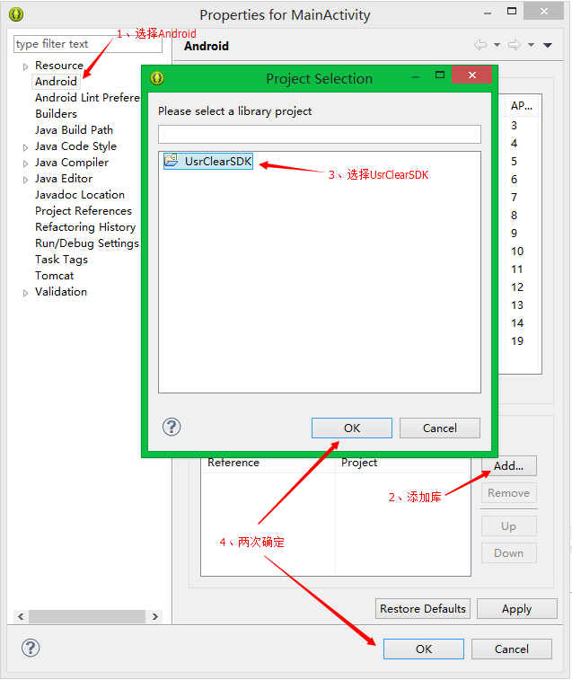
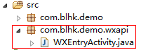

#UsrClear

##Android 快速集成指南

###分享前的准备

1. 引用 UsrClearSDK 库
	1. 将 source/UsrClearSDK 导入eclipse;
	2. 鼠标右键点击你的工程(或者UsrClearDemo工程)，选择 **Properties**;
	3. 进入 **Properties** 界面后，如下图操作：
	
		

2. 在工程中的 assets 文件夹中创建一个名为 userclear.xml 的XML文件，具体内容如下：

	```xml
	<?xml version="1.0" encoding="utf-8"?>
	<UsrClear>
		<UsrClearSDK
			AppKey="UsrClear官网申请的appkey"
			ServerUrl="服务器路径" />
		<SinaWeibo
			AppKey="新浪微博开放平台申请的appkey"
			RedirectUrl="新浪微博开放平台设置的回调页" />
		<TxWeiXin AppId="微信开放平台申请的appid" />
	</UsrClear>
	```

	1. `UsrClearSDK`节点下的`AppKey`需要在 [UsrClearSDK官网](http://mta.lbadvisor.com/) 注册用户，并成功创建应用后可以获得;`ServerUrl`可以使用`mta.lbadvisor.com`

	2. `SinaWeibo`节点下的`AppKey`需要在 [新浪微博开放平台](http://open.weibo.com/) 注册用户，并成功创建应用后可以获得;`RedirectUrl`需要在创建好的应用中选择 **应用信息** > **高级信息** 中设置授权回调页

	3. `TxWeiXin`节点下的`AppId`需要在 [腾讯微信开放平台](https://open.weixin.qq.com/) 注册用户，并成功创建应用后可以获得;还必须确保应用的包名和签名与 [腾讯微信开放平台](https://open.weixin.qq.com/) 上所填写的信息一致

3. 在 AndroidManifest.xml 文件中添加以下权限：

	```xml
	<uses-permission android:name="android.permission.INTERNET" />
	<uses-permission android:name="android.permission.ACCESS_NETWORK_STATE" />
	<uses-permission android:name="android.permission.MOUNT_UNMOUNT_FILESYSTEMS"/>
	<uses-permission android:name="android.permission.WRITE_EXTERNAL_STORAGE" />
	<uses-permission android:name="android.permission.ACCESS_WIFI_STATE" />
	<uses-permission android:name="android.permission.READ_PHONE_STATE" />
	<uses-permission android:name="android.permission.GET_TASKS" />
	```

4. 在 Activity 的 `onCreate()` 方法中初始化 UserClearAPI 分享类：

	```java
	UsrClearAPI api = UsrClearAPI.init(this, "服务器路径", "UsrClear官网申请的appkey");
	```

5. 创建 UcParameters 的实例，添加要分享的内容：

	```java
	UcParameters params = new UcParameters();
	params.putText(text); //要分享的文本
	params.putImage(bitmapImage); //要分享的图片
	```

###微信分享

* 调用 UsrClearAPI 的 share 方法分享内容

	```java
	api.share(params, shareListener, UsrClearAPI.Platform.SHARE_TX_WEIXIN_FRIENDS); //分享到微信朋友圈
	```	

	或者

	```java
	api.share(params, shareListener, UsrClearAPI.Platform.SHARE_TX_WEIXIN_FRIEND); //分享到微信好友
	```


* 分享后微信客户端的回调；在你的包名相应目录下新建一个 wxapi 目录，并在该 wxapi 目录下新增一个 WXEntryActivity 类（内部实现可参考UsrClearDemo），该类继承自 Activity，并实现 IWXAPIEventHandler 接口（例如应用程序的包名为 com.blhk.demo，则新添加的类如下图所示）：

	

	并在AndroidManifest.xml文件里面注册WXEntryActivity，添加如下代码：
	
	```xml
	<activity
            android:name=".wxapi.WXEntryActivity"
            android:exported="true"
            android:screenOrientation="portrait"
            android:theme="@android:style/Theme.Translucent.NoTitleBar" />
	```

###新浪微博分享

* 调用 UsrClearAPI 的 share 方法分享（以下步骤可二选一）：

	* 无界面分享

		```java
		api.share(params, shareListener, UsrClearAPI.Platform.SHARE_SINA_WEIBO_NO_DIALOG); //无界面分享至新浪微博
		```
	
		需要重写 Activity 中的 onActivityResult 方法,并在 onActivityResult 方法中调用UserClearAPI的onResult方法,例如：
	
	  	```java
		@Override
		protected void onActivityResult(int requestCode, int resultCode, Intent data) {
			api.onResult(requestCode, resultCode, data);
		}
		```

	* 调用UsrClear分享界面进行分享

		```java
		api.share(params, shareListener, UsrClearAPI.Platform.SHARE_SINA_WEIBO_DIALOG); //跳转UsrClear界面分享至新浪微博
		```
	
		需要在AndroidManifest.xml文件内注册UsrClearActivity：
		
		```xml
		<activity
	        android:name="com.blhk.usrclear.activity.UsrClearActivity"
	        android:theme="@android:style/Theme.Translucent" >
	        <intent-filter>
	            <action android:name="com.sina.weibo.sdk.action.ACTION_SDK_REQ_ACTIVITY" />
	        </intent-filter>
	    </activity>
		```

---

**注意：UsrClearSDK 以及 UsrClearDemo 的编码格式为 UTF-8**